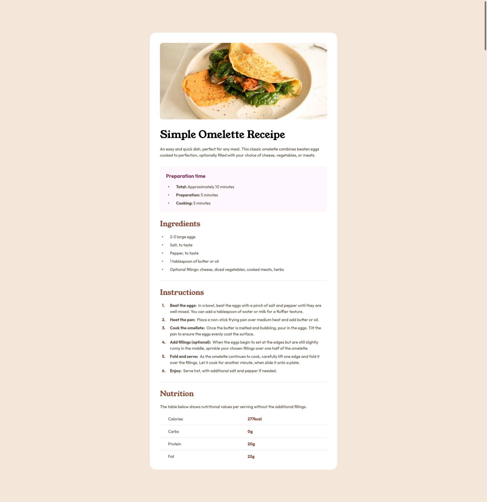
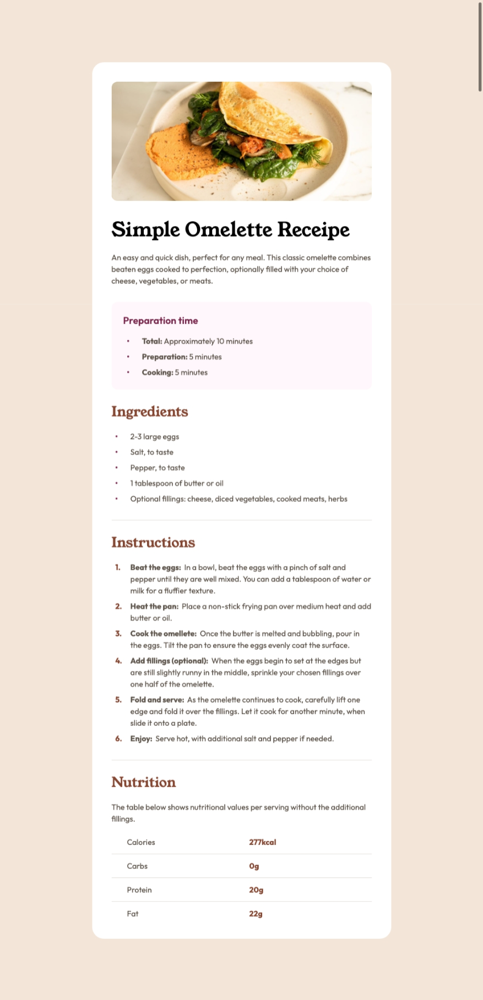
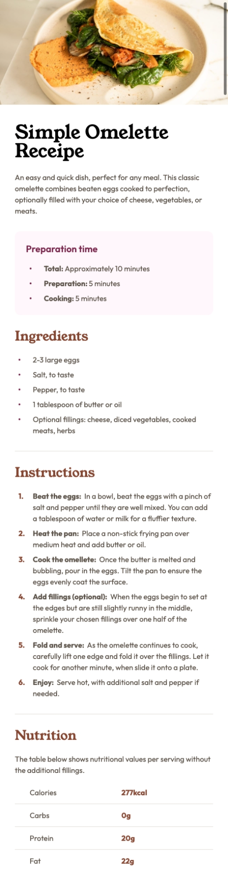

# Frontend Mentor - Recipe page solution

This is a solution to the [Recipe page challenge on Frontend Mentor](https://www.frontendmentor.io/challenges/recipe-page-KiTsR8QQKm). Frontend Mentor challenges help you improve your coding skills by building realistic projects. 

## Table of contents

- [Frontend Mentor - Recipe page solution](#frontend-mentor---recipe-page-solution)
  - [Table of contents](#table-of-contents)
  - [Overview](#overview)
    - [Screenshot](#screenshot)
      - [Large Screen](#large-screen)
      - [Medium Screen](#medium-screen)
      - [Small Screen](#small-screen)
    - [Links](#links)
  - [My process](#my-process)
    - [Built with](#built-with)
    - [What I learned](#what-i-learned)
    - [Continued development](#continued-development)
  - [Author](#author)

## Overview

### Screenshot

#### Large Screen

#### Medium Screen

#### Small Screen

### Links

- Solution URL: [Link](https://your-solution-url.com)
- Live Site URL: [Link](https://your-live-site-url.com)

## My process

### Built with

- Semantic HTML5 markup
- Flexbox
- Mobile-first workflow
- [vite](https://vite.dev/) - Build Tool

### What I learned

How to make mobile first design with a good looking using tailwindcss

### Continued development

I want to focus in improving my skills using tailwindcss

## Author

- Frontend Mentor - [@samehelhawary](https://www.frontendmentor.io/profile/samehelhawary)
